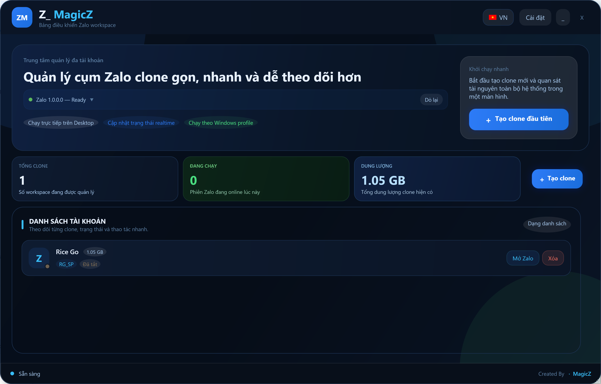

  
  <h1>Z_magicZ</h1>
  
<strong>Công cụ tối ưu chạy nhiều tài khoản Zalo trên cùng một máy tính.</strong>

  
<i>Created By MagicZ — Giao diện hiện đại, an toàn và hoạt động độc lập 100%.</i>

## 📸 Giao diện

  

---

## 🌟 Giới thiệu
**Z_magicZ** là một phần mềm Portable nhỏ gọn được thiết kế để quản lý và vận hành nhiều tài khoản Zalo cùng lúc (Zalo Clones) trên Windows 10/11. Bằng cách sử dụng cơ chế tạo các người dùng Windows (Windows Users) ẩn, Z_magicZ cách ly hoàn toàn bộ nhớ đệm và dữ liệu của từng tài khoản, đảm bảo chúng không bao giờ bị xung đột hay đăng xuất chéo.

## ✨ Tính năng nổi bật
* **Không cần cài đặt:** Chạy trực tiếp dưới dạng Portable (.exe).
* **Quản lý tập trung (Dashboard):** Giao diện Bento tối giản, theme Blue Gradient chuyên nghiệp.
* **Cách ly dữ liệu 100%:** Mỗi clone chạy trên một phiên bản Windows User riêng.
* **Theo dõi trạng thái thời gian thực:** Hiển thị tự động tài khoản nào đang hoạt động.
* **Khởi động Zalo trong 1 click:** Tạo Shortcut tự động ra màn hình chính, hoặc mở từ danh sách.
* **Đa ngôn ngữ:** Hỗ trợ Tiếng Việt / English, chuyển đổi tức thì bằng nút cờ 🇻🇳 / 🇺🇸.
* **Xóa clone sạch sẽ:** Tự động kill process, thu hồi quyền và xóa toàn bộ folder trên ổ đĩa.

## 🚀 Hướng dẫn sử dụng
### Bước 1: Chuẩn bị
Tải về file `Z_magicZ.exe` từ mục Release. Không cần cài đặt — chạy trực tiếp.

> ⚠️ Khuyến nghị đặt file trên ổ `D:\` hoặc `E:\` thay vì `C:\` để tránh đầy bộ nhớ hệ thống.

### Bước 2: Thiết lập đường dẫn (Chỉ làm 1 lần)
1. Mở file `Z_magicZ.exe`.
2. Bấm vào nút **Cài đặt** góc trên bên phải.
3. Ở mục **Thư mục Zalo gốc**, nhấn **Tự dò** để phần mềm tự tìm Zalo trên máy.
4. Ở mục **Thư mục lưu clone**, chọn nơi bạn muốn lưu các bản Zalo phụ (Vd: `D:\ZaloClone`).
5. Bấm **Lưu cài đặt**.

### Bước 3: Tạo Clone Zalo mới
1. Trên giao diện chính, bấm nút **+ Tạo clone**.
2. Nhập **Tên hiển thị** (Ví dụ: *Zalo Bán Hàng 1*).
3. Đặt **Tên Windows user** và **Mật khẩu** (Tùy chọn).
4. Nhấn **Tạo Clone** và đợi khoảng 10-30 giây.

### Bước 4: Sử dụng
* Mỗi Clone mới tạo ra sẽ nằm trong danh sách ở Dashboard.
* Bấm **Mở Zalo** trên Clone tương ứng để đăng nhập.
* Quét mã QR bình thường như Zalo chính!
* Muốn xóa, bấm **Xóa** — phần mềm sẽ tự dọn dẹp sạch sẽ trên ổ đĩa.

---
## ⚠️ Tuyên bố miễn trừ trách nhiệm

> **Z_magicZ** hiện đang trong giai đoạn thử nghiệm và phát triển liên tục.
> 
> Phần mềm được cung cấp nguyên trạng **"AS IS"** — không đi kèm bất kỳ cam kết hay bảo đảm nào. Tác giả **không chịu trách nhiệm** đối với mọi rủi ro phát sinh trong quá trình sử dụng, bao gồm nhưng không giới hạn: bị khóa tài khoản, mất dữ liệu, hay bất kỳ thiệt hại nào liên quan đến tài khoản Zalo của bạn.
> 
> Bằng việc tải về và sử dụng, bạn đồng ý tự chịu hoàn toàn rủi ro và hiểu rằng đây là công cụ cá nhân, không liên kết với Zalo/VNG Corporation.

  <i>Created By 💙 <b>MagicZ</b></i>

